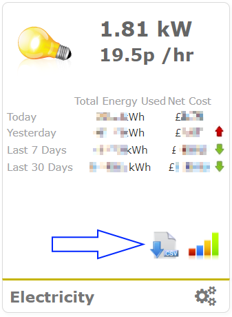
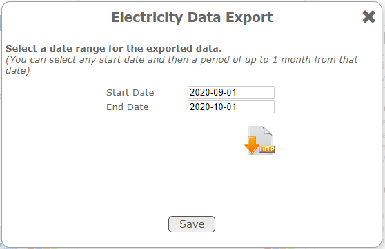

# Octoyosu - Owl Intuition

Octoyosu is a small command line tool that works out how much you would save on the [Octopus Energy Agile](https://octopus.energy/agile/) tariff.

This fork of [jpsingleton/octoyosu](https://github.com/jpsingleton/octoyosu) allows the use of historical readings logged to Owl Intuition and combines this with pricing data to calculate savings information from your current supplier and compares this with the Octopus Energy Agile tariff, to indicate if your usage patterns would result in savings as a result of the Agile tariff which updates throughout the course of every day.

## Example

```text
🐙 🐙 🐙 🐙 🐙 🐙 🐙 🐙 🐙 🐙 🐙 🐙 🐙 🐙 🐙

Wed 11 Mar 2020 to Tue 09 Jun 2020 (91 days)
Period total 770.37 kWh (approx)
Daily average 8.47 kWh (approx)
Yearly average 3092 kWh (approx)
Monthly average 258 kWh (approx)

Current Supplier:
Period total 137.44 GBP inc. VAT (approx)
Daily average 1.51 GBP inc. VAT (approx)
Yearly average 552 GBP inc. VAT (approx)
Monthly average 46 GBP inc. VAT (approx)

Loading agile pricing and calculating...

Agile:
Period total 84.24 GBP inc. VAT (approx)
Daily average 0.93 GBP inc. VAT (approx)
Yearly average 338 GBP inc. VAT (approx)
Monthly average 28 GBP inc. VAT (approx)

Savings:
Period total 53.20 GBP inc. VAT (approx)
Daily average 0.59 GBP inc. VAT (approx)
Yearly average 214 GBP inc. VAT (approx)
Monthly average 18 GBP inc. VAT (approx)

Current Supplier 100%: 🐙🐙🐙🐙🐙🐙🐙🐙🐙🐙
           Agile  61%: 🐙🐙🐙🐙🐙🐙

Done in 502ms
```

## Usage

Download the [Octopus Agile tariff pricing data for your region from energy-stats.uk](https://www.energy-stats.uk/download-historical-pricing-data/).

Download your usage from [Owl Intuition](https://www.owlintuition.com/). You can download 1 month at a time, by select the CSV icon on the Electricity panel. Owl only allows you to download some recent months worth of data, selecting too far back results in an empty csv.




The downloaded CSV will look something similar to:

```text
timestamp,curr_property,curr_property_cost,day_property,day_property_cost,curr_solar_generating,curr_solar_export,day_solar_generated,day_solar_export,curr_chan1,curr_chan2,curr_chan3,day_chan1,day_chan2,day_chan3,solar_chan1,solar_chan2,solar_chan3,day_solar1,day_solar2,day_solar3
2020-09-01 00:00:07,924,11,15,20,0,0,0,0,0,924,0,0,15,0,0,0,0,0,0,0
2020-09-01 00:01:07,924,11,30,20,0,0,0,0,0,924,0,0,30,0,0,0,0,0,0,0
2020-09-01 00:02:07,924,11,46,20,0,0,0,0,0,924,0,0,46,0,0,0,0,0,0,0
2020-09-01 00:03:07,924,11,61,20,0,0,0,0,0,924,0,0,61,0,0,0,0,0,0,0
2020-09-01 00:04:07,924,11,77,20,0,0,0,0,0,924,0,0,77,0,0,0,0,0,0,0
2020-09-01 00:05:07,907,11,92,21,0,0,0,0,0,907,0,0,92,0,0,0,0,0,0,0
2020-09-01 00:05:43,940,11,92,21,0,0,0,0,0,940,0,0,92,0,0,17,0,0,0,0
2020-09-01 00:05:55,924,11,92,21,17,0,0,0,0,924,0,0,92,0,0,0,0,0,0,0
2020-09-01 00:06:07,924,11,107,21,0,0,0,0,0,924,0,0,107,0,0,17,0,0,0,0
2020-09-01 00:07:07,873,10,122,21,17,0,0,0,0,873,0,0,122,0,0,0,0,0,0,0
```

The values used from the csv are `timestamp` and `day_property`.

Clone this repository
(you will need the [.NET (Core) SDK](https://dotnet.microsoft.com/download) installed).

```bash
git clone https://github.com/shortbloke/octoyosu.git
```

Copy both CSV files to the octoyosu directory.

Edit program.cs and adjust the values for your current tariff. Note prices should include VAT:

```csharp
        private const decimal currentSupplierUnitRate = 0.1146m;
        private const decimal currentSupplierStandingCharge = 0.19m;
        private const decimal ocotopusAgileStandingCharge = 0.21m;
```

Run the tool.

```bash
dotnet run
```

You can also specify the paths to the files manually (and run in Release mode to remove the execution time info).

```bash
dotnet run ~/Downloads/detailedReadings.csv ~/Downloads/csv_agile_J_South_Eastern_England.csv -c Release
```

## Limitations

Owl Intuition uses a current clamp logger which are not 100% accurate. The relative percentages will be correct but the kWh and £ GBP values require data directly read from the meter to be precise (e.g. a smart meter).

## License

Licensed under the [EUPL-1.2-or-later](https://joinup.ec.europa.eu/collection/eupl/introduction-eupl-licence)

This project is _treeware_! If you found it useful then please [plant a tree for me](https://offset.earth/unitsetsoftware).

[](https://offset.earth/unitsetsoftware)
